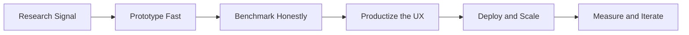

<div align="center">
  
</div>

<div align="center">
  <a href="https://github.com/BiradarScripts">
    
  </a>
  <a href="https://github.com/BiradarScripts?tab=followers">
    
  </a>
  
  
  
</div>

<br/>

<table>
<tr>
<td width="55%" valign="top">
<pre lang="python">
class ShreyasBiradar:
    alias = "Balidaan"
    role = "AI Engineer / Multimodal Builder"
    base = "IIIT Bangalore | Bengaluru, India"
    current_station = "Krutrim AI (OLA)"
    education = "IMTech ECE (2022-2027)"
    contact = "pei2004shreyas@gmail.com"

    def now(self):
        return [
            "multilingual ETL and FastAPI model services",
            "AWS EKS deployments and AI infra that holds up",
            "BLIP + LoRA VQA with stronger evaluation design",
            "market forecasting with LSTM / Transformer / Mamba",
            "enterprise DocAI and accessibility-first products",
        ]

    def edge(self):
        return "research depth x systems discipline x product instinct"

    def philosophy(self):
        return "Build with force. Measure honestly. Ship what matters."
</pre>
</td>
<td width="45%" valign="top">
  
  <br/>
  
</td>
</tr>
</table>

## `signal://live-dashboard`

<div align="center">
  
</div>

<table>
<tr>
<td width="50%">
  
</td>
<td width="50%">
  
</td>
</tr>
<tr>
<td width="50%">
  
</td>
<td width="50%">
  
</td>
</tr>
</table>

<div align="center">
  
</div>

## `mission://build-surface`

<div align="center">
  
</div>

<table>
<tr>
<td width="33%" valign="top">
<strong>AI Infra</strong><br/>
FastAPI model services, multilingual ETL, AWS EKS, and production-first systems that stay sharp outside the demo.
</td>
<td width="33%" valign="top">
<strong>Multimodal Systems</strong><br/>
VQA, DocAI, better evaluation design, and models that are useful under pressure instead of only on clean benchmarks.
</td>
<td width="33%" valign="top">
<strong>Applied Research</strong><br/>
Forecasting, adversarial testing, accessibility products, and rapid experiments that turn into working software.
</td>
</tr>
</table>

<table>
<tr>
<td width="50%" valign="top">
<strong>Now Building</strong><br/>
- Krutrim AI (OLA): multilingual ETL, FastAPI services, AWS EKS<br/>
- Multimodal VQA: BLIP + LoRA with custom evaluation beyond exact match<br/>
- Quant-Gambit: LSTM vs Transformer vs Mamba for market forecasting
</td>
<td width="50%" valign="top">
<strong>Also In Motion</strong><br/>
- LedgerShield: adversarial benchmark for enterprise DocAI agents<br/>
- Brailey: accessibility workflows for visually impaired students<br/>
- Interfaces that feel fast, decisive, and impossible to ignore
</td>
</tr>
</table>

## `impact://scoreboard`

<table>
<tr>
<td align="center" width="25%">
<br/>
<strong>Innovation Challenge</strong><br/>
<sub>AI website, ads, and CI/CD generator</sub>
</td>
<td align="center" width="25%">
<br/>
<strong>Codeathon</strong><br/>
<sub>AI-driven MSME identity system</sub>
</td>
<td align="center" width="25%">
<br/>
<strong>Challenge Ranking</strong><br/>
<sub>Multimodal price prediction under pressure</sub>
</td>
<td align="center" width="25%">
<br/>
<strong>Exchange Finalist</strong><br/>
<sub>Agentic code generation finalist</sub>
</td>
</tr>
<tr>
<td align="center" width="25%">
<br/>
<strong>Grid 6.0</strong><br/>
<sub>Food freshness, MRP, and expiry CV system</sub>
</td>
<td align="center" width="25%">
<br/>
<strong>Winning Streak</strong><br/>
<sub>AI, product, fintech, and hard problem spaces</sub>
</td>
<td align="center" width="25%">
<br/>
<strong>Work in the Arena</strong><br/>
<sub>AI infra, multilingual ETL, and EKS deployments</sub>
</td>
<td align="center" width="25%">
<br/>
<strong>OSS Contributions</strong><br/>
<sub>Factory Pattern and unified routing work</sub>
</td>
</tr>
</table>

## `build-loop://how-i-think`



## `timeline://trajectory`

```text
2022 -> IIIT Bangalore -> systems foundation, signal processing, early product builds
2023 -> stronger voice + NLP systems -> hackathon momentum and faster shipping
2024 -> Think LogiTech + AsyncAPI OSS -> AIR 156 + Flipkart podium + wider product scope
2025 -> Krutrim AI (OLA) -> multilingual ETL + FastAPI services + AWS EKS + multimodal research
2026 -> open to work -> building serious AI products with research, infra, and product force
```

## `handshake://build-something-hard`

<div align="center">
  <a href="mailto:pei2004shreyas@gmail.com">
    
  </a>
  <a href="https://github.com/BiradarScripts?tab=repositories">
    
  </a>
  <a href="https://github.com/BiradarScripts">
    
  </a>
</div>

<div align="center">
  <sub>If you are building serious AI products, multimodal workflows, or infra that actually has to scale, we should talk.</sub>
</div>

<br/>

<div align="center">
  <picture>
    <source media="(prefers-color-scheme: dark)" srcset="https://raw.githubusercontent.com/BiradarScripts/BiradarScripts/output/github-snake-dark.svg" />
    <source media="(prefers-color-scheme: light)" srcset="https://raw.githubusercontent.com/BiradarScripts/BiradarScripts/output/github-snake.svg" />
    
  </picture>
</div>

<div align="center">
  
</div>
